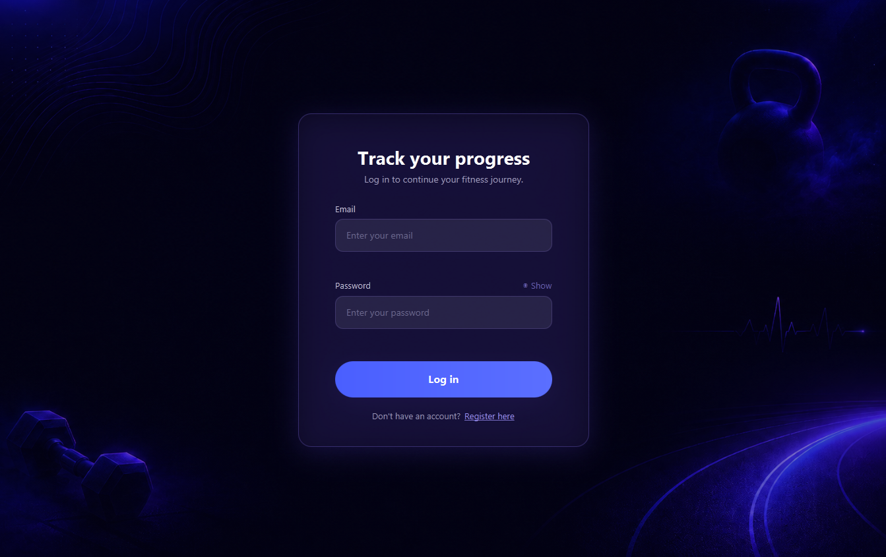
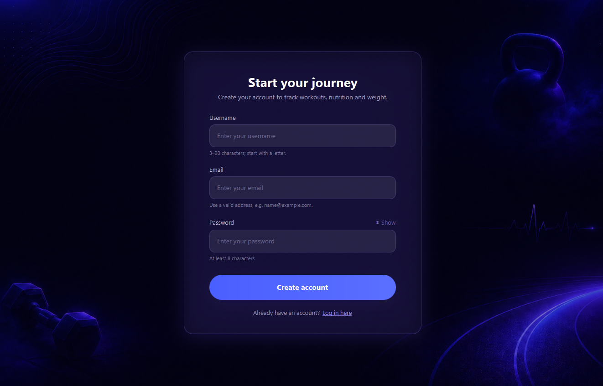
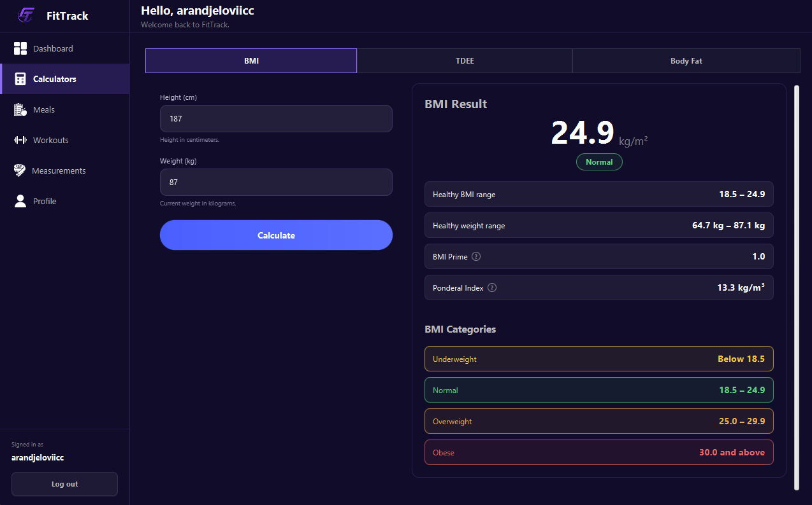
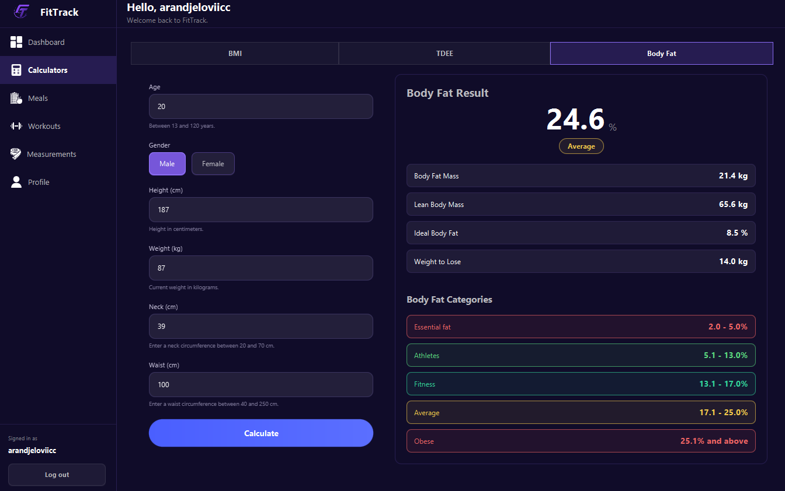

# FitTrack

FitTrack is a desktop fitness tracking application built with JavaFX and Spring Boot.

The application allows users to create an account, manage their profile, calculate important fitness metrics and, in future versions, track meals, workouts and body measurements.

## Features

### Implemented

- User registration
- User login
- Password hashing
- User session
- Profile setup
- PostgreSQL database integration
- Spring Boot REST API
- JavaFX desktop interface
- Responsive JavaFX layouts
- View caching and state preservation
- BMI calculator
- BMR calculator
- TDEE calculator
- Body fat percentage calculator
- Body fat category calculation
- Ideal body fat estimation
- Fat mass and lean mass calculation

### In Development

- Meal tracking
- Global food database
- Custom user-created foods
- Food search
- Daily meal history
- Nutrition and macronutrient tracking
- Dashboard
- Body measurements and progress tracking
- Workout tracking
- User profile editing

## Architecture

FitTrack is separated into two applications:

```text
JavaFX Desktop Frontend
        |
        | HTTP / JSON
        v
Spring Boot REST API
        |
        v
PostgreSQL Database
```
The project contains:

```text
frontend/
backend/
```

The frontend handles the user interface, while the backend handles business logic, authentication and database access.

## Technologies

### Frontend

- Java 22
- JavaFX 22
- FXML
- CSS
- Maven
- Jackson
- Java HTTP Client

### Backend

- Java
- Spring Boot
- Spring Web
- Spring Data JPA
- Hibernate
- Jakarta Validation
- BCrypt
- PostgreSQL
- Maven

### Database

- PostgreSQL
- Neon

## Screenshots


### Login



### Register



### BMI Calculator



### Body Fat Calculator



## Planned Features

Future improvements may include:

- Complete nutrition and meal tracking
- Meal history by date
- Custom foods and serving sizes
- Weight and body measurement history
- Progress charts
- Workout logging
- Exercise history
- Fitness dashboard with daily statistics
- Improved profile management
- Additional calculators
- Better reporting and statistics

## Project Structure

```text
OOP-Project/
├── frontend/
│   └── JavaFX desktop application
│
├── backend/
│   └── Spring Boot REST API
│
└── README.md
```