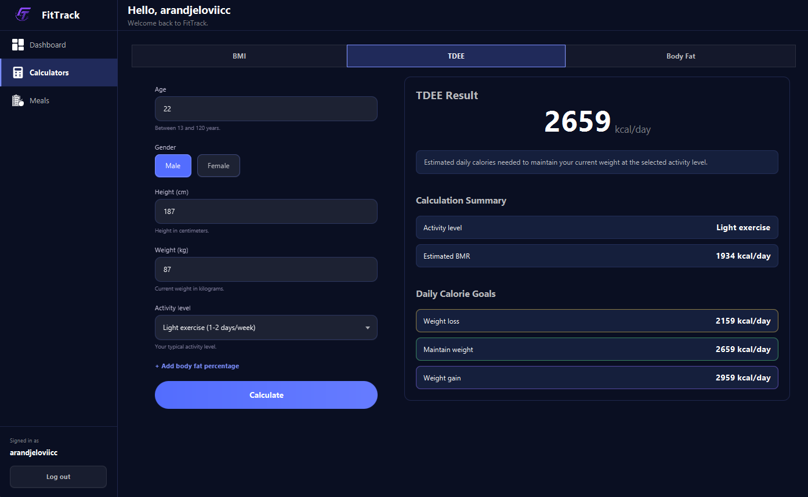
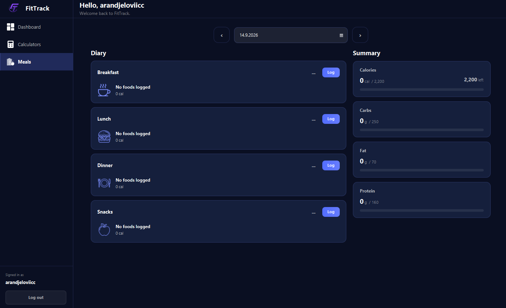
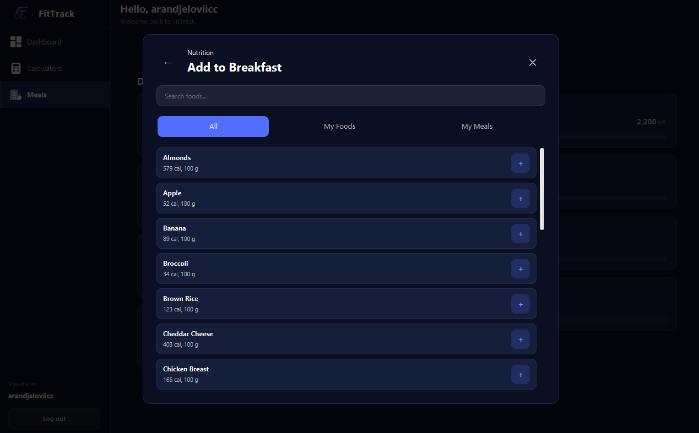
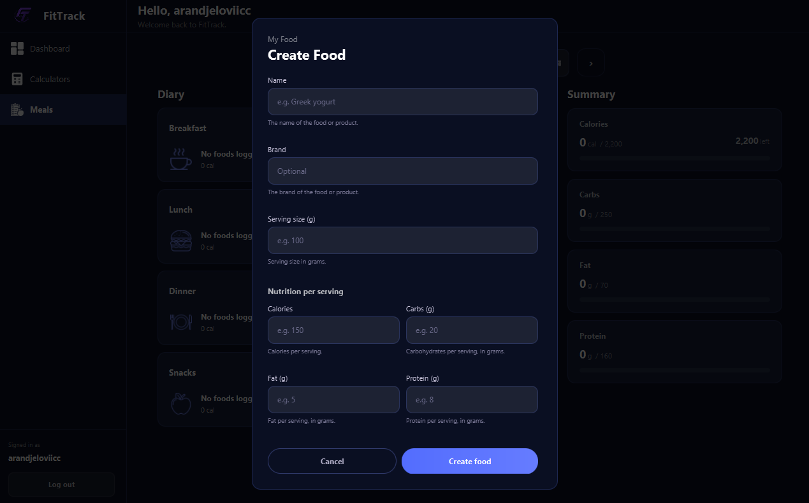
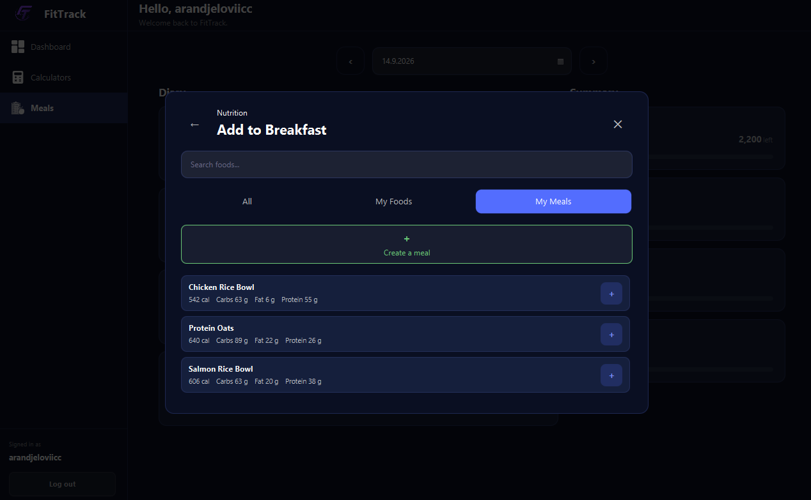
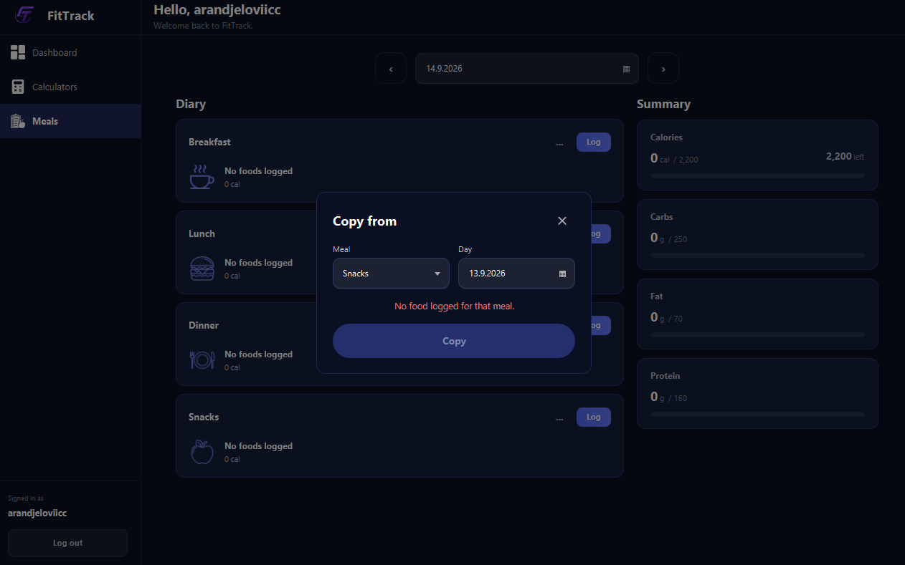

# FitTrack

FitTrack is a desktop fitness tracking application built with JavaFX and Spring Boot.

The project focuses primarily on nutrition and meal tracking, while also providing fitness calculators, user profile setup, responsive layouts and a foundation for future modules such as body measurements, workout tracking and dashboard analytics.

## Features

### Implemented

#### Authentication and User Management

- User registration
- User login
- BCrypt password hashing
- User session management
- Profile setup

#### Nutrition and Meal Tracking

- Daily meal tracking
- Breakfast, lunch, dinner and snack organization
- Nutrition and macronutrient summaries
- Global food database
- Custom user-created foods
- Food search
- Serving size and serving quantity support
- Add, edit and remove foods from meals
- Daily meal history by date
- Saved meals
- Log saved meals into a selected meal
- Copy meals between dates
- Nutrition target progress indicators
- Responsive meal layouts
- View caching and state preservation

#### Fitness Calculators

- BMI calculator
- BMR calculator
- TDEE calculator
- Body fat percentage calculator
- Body fat category calculation
- Ideal body fat estimation
- Fat mass and lean mass calculation

#### Technical Features

- JavaFX desktop interface
- Responsive JavaFX layouts
- Spring Boot REST API
- PostgreSQL database integration
- Neon cloud database
- Flyway database migrations
- Jakarta Validation
- Centralized frontend HTTP client
- Layered frontend architecture with controllers, services and API classes

## Architecture

FitTrack is separated into two applications:

```text
JavaFX Desktop Frontend
        |
        | HTTP / JSON
        v
Spring Boot REST API
        |
        v
PostgreSQL Database
```

The project contains:

```text
frontend/
backend/
```

The frontend is responsible for the user interface, user interaction and presentation logic.

The backend is responsible for business logic, validation, authentication-related operations and database access.

The frontend follows a layered structure similar to:

```text
FXML
  |
Controller
  |
Service
  |
API
  |
ApiClient
  |
HTTP / JSON
  |
Spring Boot Backend
```

## Technologies

### Frontend

- Java 22
- JavaFX 22
- FXML
- CSS
- Maven
- Jackson
- Java HTTP Client

### Backend

- Java 22
- Spring Boot
- Spring Web
- Spring Data JPA
- Hibernate
- Jakarta Validation
- BCrypt
- Flyway
- PostgreSQL
- Maven

### Database

- PostgreSQL
- Neon

## Screenshots

### Authentication

#### Login


#### Register


### Fitness Calculators

#### BMI Calculator


#### TDEE Calculator



#### Body Fat Calculator


### Meals and Nutrition

#### Daily Meals Overview



#### Add Food to Meal



#### Create Custom Food



#### Saved Meals



#### Copy Meal



> Additional screenshots may be added as the remaining application modules are completed.

## In Development

The following modules are planned for the current project:

- User profile viewing and editing
- Weight tracking
- Body measurement tracking
- Progress charts with selectable time ranges
- Basic exercise management
- Basic workout creation and logging
- Dashboard with nutrition, measurement and workout information
- Interactive 2D muscle map

## Planned Future Improvements

After the current desktop version is completed, the project may be expanded with:

- More advanced workout tracking
- Exercise progress history
- Personal records and training statistics
- Additional dashboard cards and analytics
- Extended body measurement reports
- Improved nutrition reporting
- Additional calculators
- Further UI and accessibility improvements
- Native mobile application

## Project Structure

```text
OOP-Project/
├── frontend/
│   └── JavaFX desktop application
│
├── backend/
│   └── Spring Boot REST API
│
├── docs/
│   └── screenshots/
│
└── README.md
```
